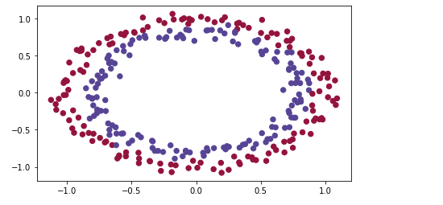
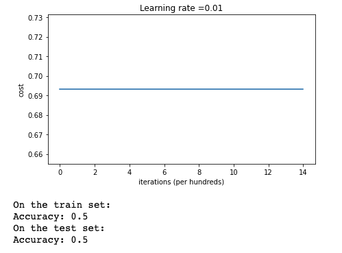
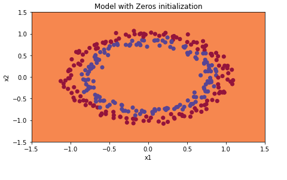
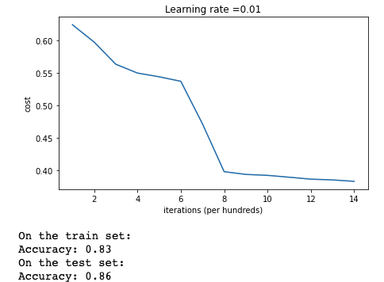
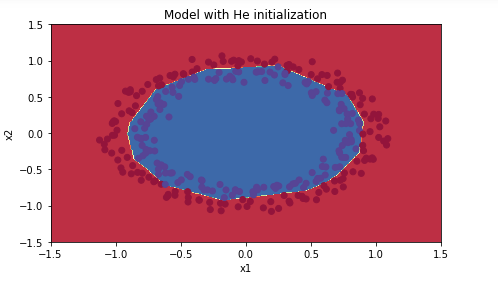
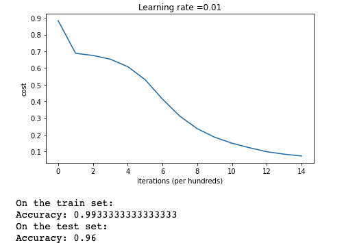
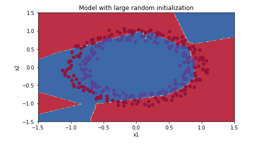
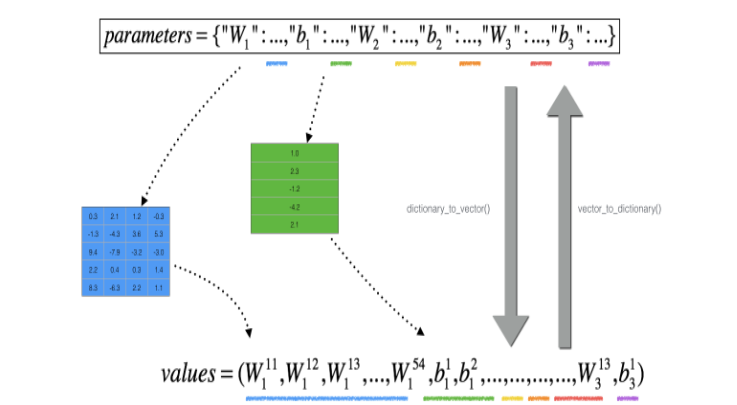

[](https://opensource.org/licenses/MIT)


# Hyperparameter Tuning for Deep Learning

This repository contains Jupyter notebooks for the assignments and projects completed as part of the course "Improving Deep Neural Networks: Hyperparameter Tuning, Regularization and Optimizationks" within the [Andrew NG deep learning specialization](https://www.coursera.org/learn/deep-neural-network?specialization=deep-learning) on [Coursera](https://www.coursera.org/]).

## Course Description

This course focuses on advanced topics in deep neural networks, including hyperparameter tuning, regularization, and optimization. You will learn how to improve the performance of your deep learning models by using different techniques and strategies. By the end of this course, you will have a deeper understanding of how to make your models more robust, accurate, and efficient.

## Notebook list
- **Week 1**: Weight Initialization
- **Week 2**: Regularization
- **Week 3**: Gradient Checking

## Requirements
- Jupyter Notebook
- Python 3
- Tensorflow 2
- Numpy, Matplotlib, Pandas

## Usage
1. Clone the repository

```
git clone https://github.com/paligonshik/Deep-Learning-Hyperparameter-Tuning.git
```
2. Install the required packages

``` 
pip install -r requirements.txt
```
3. Jupyter Notebook
```
jupyter notebook
```

# [Weight Initialization](Weight_Initialization)
In this repo,

I will use a 3-layer neural network. I will experiment with the following initialization methods:

- Zeros Initialization - by setting initialization = "zeros" in the input argument.

- Random Initialization - by setting initialization = "random" in the input argument. This initializes the weights to large random values.
- He Initialization - by setting initialization = "he" in the input argument. This initializes the weights to random values scaled according to a paper by He et al., 2015.

Instructions: read over the code and run it. In the next part, I will implement the three initialization methods that the model() function calls.

For this classifier, you want to separate the blue dots from the red dots.




##  Initialization

There are two types of parameters to initialize in a neural network:
- the weight matrices $(W^{[1]}, W^{[2]}, W^{[3]}, ..., W^{[L-1]}, W^{[L]})$
- the bias vectors $(b^{[1]}, b^{[2]}, b^{[3]}, ..., b^{[L-1]}, b^{[L]})$


### Zero Initialization




### Random Initialization




### He Initialization
$$W = \mathcal{N}(\mu=0,\ \sigma=\sqrt{\frac{2}{n_{l-1}}})\ $$

where,

$W$ represents the weight matrix
$\mathcal{N}$ represents a normal distribution
$\mu$ represents the mean of the normal distribution and is set to 0
$\sigma$ represents the standard deviation of the normal distribution
$n_{l-1}$ represents the number of neurons in the previous layer
This formula initializes the weights with random values sampled from a normal distribution with a mean of 0 and a standard deviation of $\sqrt{\frac{2}{n_{l-1}}}$.




# [Regularization](Regularization)
In this repo I am using some regularization to avoid overfitting. I'll modify cost function using Ridge Technique and also will apply Dropout Method

<a name='5'></a>
## L2 Regularization

The standard way to avoid overfitting is called **L2 regularization**. It consists of appropriately modifying my cost function, from:
$$J = -\frac{1}{m} \sum\limits_{i = 1}^{m} \large{(}\small  y^{(i)}\log\left(a^{[L](i)}\right) + (1-y^{(i)})\log\left(1- a^{[L](i)}\right) \large{)} \tag{1}$$
To:
$$J_{regularized} = \small \underbrace{-\frac{1}{m} \sum\limits_{i = 1}^{m} \large{(}\small y^{(i)}\log\left(a^{[L](i)}\right) + (1-y^{(i)})\log\left(1- a^{[L](i)}\right) \large{)} }_\text{cross-entropy cost} + \underbrace{\frac{1}{m} \frac{\lambda}{2} \sum\limits_l\sum\limits_k\sum\limits_j W_{k,j}^{[l]2} }_\text{L2 regularization cost} \tag{2}$$

Let's modify the cost and observe the consequences.

<a name='ex-1'></a>
### Compute_cost_with_regularization
Implement `compute_cost_with_regularization()` which computes the cost given by formula (2). To calculate $\sum\limits_k\sum\limits_j W_{k,j}^{[l]2}$  , use :
```python
np.sum(np.square(Wl))
```
Note that I had to do this for $W^{[1]}$, $W^{[2]}$ and $W^{[3]}$, then sum the three terms and multiply by $ \frac{1}{m} \frac{\lambda}{2} $.


## Dropout is a widely used regularization technique that is specific to deep learning. It randomly shuts down some neurons in each iteration.


In lecture, we dicussed creating a variable $d^{[1]}$ with the same shape as $a^{[1]}$ using `np.random.rand()` to randomly get numbers between 0 and 1. Here, you will use a vectorized implementation, so create a random matrix $D^{[1]} = [d^{[1](1)} d^{[1](2)} ... d^{[1](m)}] $ of the same dimension as $A^{[1]}$.
2. Set each entry of $D^{[1]}$ to be 1 with probability (`keep_prob`), and 0 otherwise.

**Hint:** Let's say that keep_prob = 0.8, which means that we want to keep about 80% of the neurons and drop out about 20% of them.  We want to generate a vector that has 1's and 0's, where about 80% of them are 1 and about 20% are 0.
This python statement:  
`X = (X < keep_prob).astype(int)`  

is conceptually the same as this if-else statement (for the simple case of a one-dimensional array) :

```
for i,v in enumerate(x):
    if v < keep_prob:
        x[i] = 1
    else: # v >= keep_prob
        x[i] = 0
```
Note that the `X = (X < keep_prob).astype(int)` works with multi-dimensional arrays, and the resulting output preserves the dimensions of the input array.

Also note that without using `.astype(int)`, the result is an array of booleans `True` and `False`, which Python automatically converts to 1 and 0 if we multiply it with numbers.  (However, it's better practice to convert data into the data type that we intend, so try using `.astype(int)`.)

3. Set $A^{[1]}$ to $A^{[1]} * D^{[1]}$. (You are shutting down some neurons). You can think of $D^{[1]}$ as a mask, so that when it is multiplied with another matrix, it shuts down some of the values.
4. Divide $A^{[1]}$ by `keep_prob`. By doing this you are assuring that the result of the cost will still have the same expected value as without drop-out. (This technique is also called inverted dropout.)


# [Gradient Checking](Gradient_Checking)

